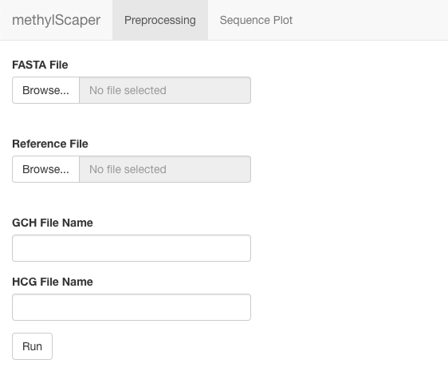
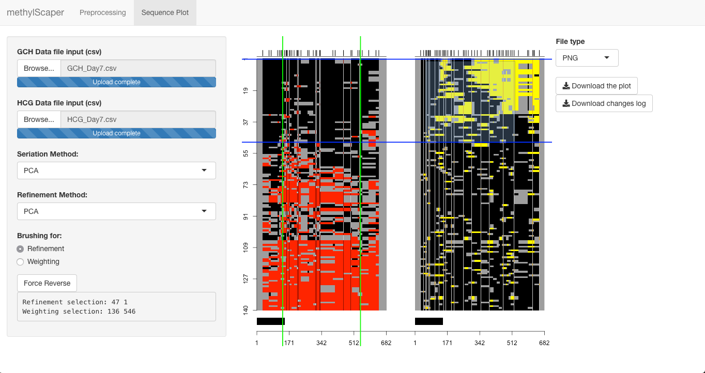

## Introduction

`methylScaper` is an R package that provides functions for processing raw sequence reads and
visualizing methylation. Users can run the package either with an interactive Shiny app, or
through the basic helper functions.

### Installation

Currently, the only way to install `methylScaper` is via the development version on GitHub.

```{r, eval = FALSE}
library(devtools)
devtools::install_github("pknight24/methylScaper")
```

## Usage

### Shiny App

The Shiny app is the primary way to use `methylScaper`, and can be run
by calling the function `methylScaper()` from an R session with the
package loaded. The app provides two panels:
one for preprocessing raw sequence reads, and the other for
interactively visualizing the processed reads. 

The "Preprocessing" panel, shown below, is opened by default. Here,
users are prompted to input two raw sequence FASTA files, the first
containing all of the raw reads and second containing the reference
sequence for the region of interest. 

After clicking "Run", `methylScaper` will perform a pairwise alignment
of each sequence, quality control and filtering poorly aligned
sequences, and conversion of the aligned sequences to methylation and
occupancy sites. We then assign a numeric value to each site, which
allows the package to order the sites for visualization using
numerical methods. 

Users are asked to enter two files paths, indicating where to save the
two processed output files. The GCH file contains the GC site data,
and the HCG file contains CG site data. 



The "Sequence Plot" panel takes the two site data files as input, and
generates a pair of sequence plots corresponding to the GC and CG site
data.
By default, the reads are ordered by the value of the first Principal
Component of the site matrix, but users may select to use Simulated
Annealing ("ARSA") as an alternative seriation method. 

Once the initial sequence plot is generated, `methylScaper` allows the
user to dynamically refine and re-weight the plot via Shiny's brushing
mechanics. Clicking and dragging along either of the two plots will
select sites (i.e., columns) by which to weight the data in the site
matrix. `methylScaper` will then regenerate the plot with a new
ordering, influenced by the weighted sites. With "PCA" selected as the
seriation method, the new ordering will be generated with a weighted
Principal Components Analysis. If "ARSA" is selected, the ordering is found by first
building a weighted Euclidean distance matrix, which is then passed to
the Simulated Annealing algorithm. Note that weighting is
done with respect to either the GC sites or the CG sites - the plot on
which brushing is performed determines which sites to use.

If "Refinement" is selected as the brushing option, clicking and
dragging on the sequence plot will select reads (i.e., rows) to
reorder locally. PCA is used by default, but Hierarchical Clustering
can also be selected as the refinement method. Unlike re-weightings,
refinements to the sequence plot stack onto each other, and several
refinements can be done to a single plot before exporting. However, it
is important to note that re-weighting the sites will reorder the
entire set of data, and hence will undo any refinements that you may
have made.



After making any desired changes, the sequence plot can be saved as
either a PNG, PDF, or SVG file. Additionally, `methylScaper` keeps
track of all changes made to the plots in the form of a changes log,
which can be saved as a text file.

### R Functions
