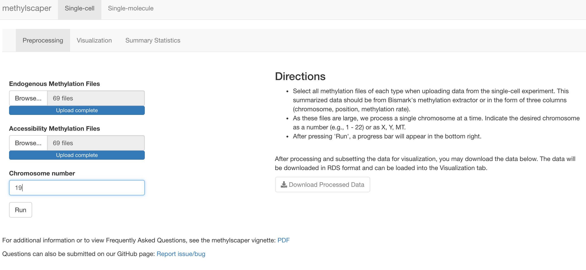

# Introduction

`methylscaper` is an R package that provides functions for processing and visualizing data generated by methods jointly profiling methylation and chromatin accessibility (MAPit, NOMe-seq, scNMT-seq, nanoNOMe, etc.). The package offers processing for both single-cell and single-molecule data using a common interface for jointly visualizing both data types through the generation of ordered representational methylation-state matrices. The package provides a Shiny app to allow for an interactive seriation process of refinement and re-weighting that optimally orders the single DNA molecules to discover methylation patterns and nucleosome positioning.


**Note:** If you use methylscaper in your research, please cite: [manuscript](https://www.biorxiv.org/content/10.1101/2020.11.13.382465v1)

If, after reading this vignette you have questions, please submit your question on GitHub: [Question or Report Issue](https://github.com/rhondabacher/methylscaper/issues). This will notify the package maintainers and benefit other users.


# Getting Started

## Installation

For local use of `methylscaper`, it can be installed into R from Bioconductor (using R version >= 4.1.0): 
```{r, eval=F}
if (!requireNamespace("BiocManager", quietly = TRUE))
    install.packages("BiocManager")

BiocManager::install("methylscaper")
```

`methylscaper` can also be installed via [GitHub](https://github.com/rhondabacher/methylscaper/). The v0.99 version is current with the Bioconductor version and only requires R version >= 4.0.0 while 4.1 is still under development or for those who have not yet upgraded.
```{r, message=FALSE, eval=F}
if (!requireNamespace("devtools", quietly=TRUE))
    install.packages("devtools")
devtools::install_github("rhondabacher/methylscaper", build_vignettes=TRUE, ref="v0.99")
```

## Load the package

After successful installation, load the package into the working space.
```{r, message = FALSE}
library(methylscaper)
```

To access the Shiny app, simply run:
```{r, eval=F}
methylscaper()
```

# Visualizing single-cell data

For analyzing single-cell data from methods such as scNMT-seq, methylscaper begins with pre-aligned data. For each cell, there should be two files, one for the GCH sites and another for the HCG sites. The minimal number of columns needed for methylscaper is three: chromosome, position, and methylation status. This type of file is generated via the "Bismark\_methylation\_extractor" script in the Bismark software tool. The extractor function outputs files in four or six column output files (see bedGraph option described here: http://felixkrueger.github.io/Bismark/Docs/). Methylscaper will accept these and convert to the three column format internally.

Due to the large file size, Methylscaper further processes the data for the visualization analysis to the chromosome level. The input files should be organized such that all GCH files are located in a subfolder labeled 'acc' and all HCG files in a subfolder labeled 'met'. In the Shiny app, first point to the directory containing these two subdirectories. Then indicate the desired chromosome to filter to the chromosome level. 

### Example data and workflow for single-cell data

Below we walk through an example using data from Clark et al., 2018, obtained from
[GSE109262](https://www.ncbi.nlm.nih.gov/geo/query/acc.cgi?acc=GSE109262). For
the sake of this example, we assume that the `GSE109262_RAW.tar`
directory is downloaded to `~/Downloads/`. After extraction of the tar file, we created the met and acc subdirectories within the GSE109262_RAW folder and moved files accordingly. 

### Preprocessing in the Shiny app

In the screenshot below, the data from GSE10926 data on chromosome 19 is processed to get ready for visualization. The folder points to the GSE109262_RAW folder containing acc and met subfolders. The chromosome should either be a number or one of X, Y, or MT.
<!-- After this processing is done, the shiny app will automatically move the files to the visualization tab for analysis. -->

{#id .class width=100% height=100%}


The preprocessing can also be done in the R console directly, which allows for additional start and end specifications. For the purpose of creating a small example to include in the package, we additionally restricted the data between base pairs 8,947,041 to 8,987,041, which is centered around the Eef1g gene. In practice, we advise users to filter to just the chromosome level to keep the region relatively large. The Visualization tab described in the next step allows for a more refined search along the chromosome.

## Preprocessing using methylscaper functions
```{r, eval=FALSE}
filepath <- "~/Downloads/GSE109262_RAW"
singlecell_subset <- subsetSC(filepath, chromosome=19, startPos = 8937041, endPos = 8997041)
# To save for later, save as an rds file and change the folder location as desired:
saveRDS(singlecell_subset, "~/Downloads/singlecell_subset.rds")
```

## Visualization in the Shiny app

The screenshot below is of the Visualization tab in the methylscaper Shiny app. First, indicate the location of the singlecell_subset.rds file. Once the file is loaded, we have included preset gene locations for Mouse (GRCm39) and Human (GRCh38), so that a gene can be selected. The input box can also be typed in and genes will begin to appear; this is the easiest way to navigate. The default start and end positions are those of the entire gene, however, a slider will appear that allows the user to refine the genomic location of interest. The start and end positions can also be manually entered. For any other organism, the start and end positions should be entered manually.

In the visualization, two heatmaps will appear. They both represent the same genomic region, but they are colored based on either CGH or HCG sites. The x-axis represents the genomic location, and the y-axis is each individual cell. The left heatmap contains the genomic region mapped to CGH sites (sites are indicated by tick marks at the top), and the right heatmap contains the genomic region mapped to GCH sites. For HCG (i.e. endogenous methylation), methylscaper colors patches in between each HCG site. If two consecutive HCG sites are methylated, a red path is present. If two consecutive HCG sites are unmethylated, a black patch is present. If two consecutive HCG sites are inconsistently methylated, the patch appears gray. For GCH (i.e. accessibility), methylscaper colors patches as follows: yellow patches occur between two methylated sites (an accessible region), black patches occur between two unmethylated sites (inaccessible region), and gray patches occur between inconsistent methylation of consecutive sites. Any missing data (e.g. no reads covered that region for a particular cell) will show up as a white patch in either heatmap.

{#id .class width=100% height=100%}

Once a region is chosen, the default ordering by methylscaper is the unweighted PCA. The user is then able to dynamically refine and re-weight the plot via Shiny's brushing mechanics. The user can click and drag the mouse across the heatmap horizontally to choose which bases (i.e. columns) should be weighted in the global PCA ordering. The plot will update and two green lines will appear to indicate the weighting positions (note that these are not included once the heatmap is downloaded).

With "PCA" selected as the seriation method, the new ordering will be generated with a weighted Principal Components Analysis. The weighting is done on the proportion of methylation within the specified region. We recommend using "PCA" as the ordering method. However, for comparison purposes, we have also included the "ARSA" method. In ARSA the ordering is found by first building a weighted Euclidean distance matrix, which is then passed to the Simulated Annealing algorithm in the seriation package. This method tends to work well on smaller datasets, but due to computational inefficiency, it is generally not recommended for very large datasets at this time.

The next (optional) step is to refine the ordering of some reads. In this case, select refinement and begin to click and drag the mouse vertically to choose which cells should be reordered locally. Blue lines will be drawn to indicate the refined cells. PCA is used by default and is also recommended, however, we provide Hierarchical clustering as an option for refinement method in the Shiny app for comparison purposes. Unlike re-weightings, refinements to the sequence plot stack onto each other, and several refinements can be done to a single plot before exporting. However, it is important to note that re-weighting the sites will reorder the entire set of data, and hence will undo any refinements that you may have made.

After making any desired changes, the sequence plot can be saved as either a PNG or PDF file. Additionally, `methylscaper` keeps track of all changes made to the plots in the form of a changes log, which can be saved as a text file.

The heatmap can then be downloaded along with a log indicating the weighting and refinement choices for reproducibility.

## Visualization using methylscaper functions

The visualization can be done using methylscaper functions as well. Each function is described individually below. There are some additional options the user can control when using the functions with the R console. 

```{r, eval=TRUE, fig.align='left', fig.width=7, fig.height=6}
# If you followed the preprocessing code above, then you can do:
# mydata <- readRDS("~/Downloads/singlecell_subset.rds")
# Otherwise, we have also included this subset in the package directly:
mydata <- system.file("extdata", "singlecell_subset.rds", package = "methylscaper")
mydata <- readRDS(mydata)
gene <- "Eef1g"
data("mouse_bm") # for human use human_bm
gene.select <- subset(mouse_bm, mgi_symbol == gene)
# We will further subset the region to a narrow region of the gene: from 8966841bp to 8967541bp
startPos <- 8966841 
endPos <- 8967541

# This subsets the data to a specific region and prepares the data for visualization:
prepSC.out <- prepSC(mydata, startPos=startPos, endPos=endPos)

# Next the cells are ordered using the PCA approach and plot
orderObj <- initialOrder(prepSC.out)
plotSequence(orderObj, Title = "Eef1g gene", plotFast=TRUE)

# We plot the nucleosome size key by default, however this can be turned off via drawKey = FALSE:
# plotSequence(orderObj, Title = "Eef1g gene", plotFast=TRUE, drawKey = FALSE)

```

The function `prepSC` generates the `gch` and `hcg` objects, which are matrices representing accessibility
and methylation status, respectively. These matrices are used by other
`methylscaper` functions for visualization and summary plots.

The `initialOrder` function computes an ordering of the state matrices, using a given method. By default, the function uses our PCA-based ordering, which we find optimally and efficiently scales to large datasets, but we have written the function to allow any method supported by the `seriation` package to be input to the Method parameter. 

To perform the weighted ordering, either on the methylation or accessibility status, we can indicate the positions as follows. The `weightFeature` should be either for 'met' (endogenous methylation) or 'acc' (accessibility).

```{r, eval=TRUE}
orderObj <- initialOrder(prepSC.out,
                         weightStart = 47, weightEnd = 358, weightFeature = "acc")
```

The sequence heatmap is then generated with the `plotSequence` function. The option 'plotFast' sets the plot parameter useRaster to TRUE, which generates a fast-loading bitmap image. To save with high resolution, change 'plotFast' to TRUE. In the Shiny app, the download button automatically generates the high resolution version.

The plot on the left corresponds to endogenous methylation status, and the right to
accessibility status. The red and yellow colored portions represent the areas on each
read that are methylated and accessible, respectively.

```{r, eval=TRUE, fig.width=7, fig.height=6}
plotSequence(orderObj, Title = "Eef1g gene", plotFast=TRUE)
```

We can also refine the ordering of the reads with `refineFunction`,
which reorders a subset of the reads with a given method. The
code below reorders the first 20 cells and generates a new sequence plot.

```{r, eval=TRUE, fig.width=7, fig.height=6}
orderObj$order1 <- refineFunction(orderObj, refineStart = 1, refineEnd = 20)
plotSequence(orderObj, Title = "Eef1g gene", plotFast=TRUE)
```

### Accessing gene positions via biomaRt objects

In the Shiny app, we have included pre-downloaded versions of the mouse (GRCm39) and human (GRCh38) gene locations to ease of use. If you wish to use another organism, we demonstrate below how to obtain these from biomaRt. 

```{r, eval=FALSE}
if (!requireNamespace("biomaRt", quietly=TRUE))
    BiocManager::install("biomaRt")
library(biomaRt)
ensembl <- useMart("ensembl")
ensembl <- useDataset("hsapiens_gene_ensembl",mart=ensembl)
my_chr <- c(1:22, 'M', 'X', 'Y') # You can choose to omit this or include additional chromosome
# We only need the start, end, and symbol:
hum_bm <- getBM(attributes=c('chromosome_name', 'start_position', 'end_position', 'hgnc_symbol'),
             filters = 'chromosome_name',
             values = my_chr,
             mart=ensembl)

## Now that we have the biomart object, we can extract start and ends for methylscaper:
gene_select <- subset(hum_bm, hum_bm$hgnc_symbol == "GeneX")

# These can then be passed into the prepSC function:
prepSC.out <- prepSC(mydata, startPos=gene_select$startPos, endPos=gene_select$endPos)

# To continue the analysis:
# Next the cells are ordered using the PCA approach and then plot:
orderObj <- initialOrder(prepSC.out)
plotSequence(orderObj, Title = "Gene X", plotFast=TRUE)
```


# Visualizing single-molecule data

For single-molecule data from MAPit type experiments, methylscaper will first preprocess the reads by aligning reads contained in a fasta file to a reference file containing the sequence of interest (also in fasta format). This analysis can also be done in either the Shiny app or in the R console.

### Preprocessing in the Shiny app

For the Shiny app, the input should be a list of reads in a fasta format and a fasta reference file. The screenshot below shows this preprocessing step. We make use of data from our [manuscript](https://www.biorxiv.org/content/10.1101/2020.11.13.382465v1) and the raw data is provided in the methylscaper package. The files can also be downloaded directly from the methylscaper website: [Example Data](http://methylscaper.com/content/exampledata.html). After selecting 'Run', a progress bar will appear in the bottom right. Once completed, the data may be downloaded along with a log file indicating the number of molecules successfully processed.

{#id .class width=100% height=100%}

### Preprocessing using methylscaper functions

To run the preprocessing in the R console, the function `runAlign` may be used. The sequences are aligned to the reference using the `Biostrings` package and then mapped to the methylation- and accessibility-state matrices. For very large datasets, the runAlign function may be run on high-throughput servers rather than locally and specifying the multicoreParam parameter.

```{r, eval = TRUE}
# This provides the path to the raw datasets located in the methylscaper package
seq_file <- system.file("extdata", "seq_file.fasta", package = "methylscaper")
ref_file <- system.file("extdata", "reference.fa", package = "methylscaper")

# Next we read the data into R using the read.fasta function from the seqinr package:
if (!requireNamespace("seqinr", quietly=TRUE))
    install.packages("seqinr")
fasta <- seqinr::read.fasta(seq_file)
ref <- seqinr::read.fasta(ref_file)

# For the vignette we will only run a subset of the molecules
singlemolecule_example <- runAlign(fasta = fasta, ref = ref, fasta_subset = 1:150)

# Once complete, we can save the output as an RDS object
# saveRDS(singlemolecule_example, file="~/methylscaper_singlemolecule_preprocessed.rds")
```


### Visualization in the Shiny app

{#id .class width=100% height=100%}

### Visualization using the methylscaper functions

Analysis of the single-molecule data in the R console uses the same functions described above in the single-cell section.

```{r, eval=TRUE, fig.width=7, fig.height=6}
# If skipping the preprocessing steps above, use our pre-aligned data:
# data(singlemolecule_example)
orderObj <- initialOrder(singlemolecule_example, Method="PCA",
                         weightStart = 308, weightEnd = 475, weightFeature = "red")
plotSequence(orderObj, Title = "Ordered by PCA", plotFast = TRUE)
```

```{r, eval=FALSE, fig.width=7, fig.height=6}
orderObj$order1 <- refineFunction(orderObj, refineStart = 6, refineEnd = 1, Method = "PCA")
plotSequence(orderObj, Title = "Ordered by PCA", plotFast = TRUE)
```

# Additional summary plots

Both single-cell and single-molecule data can be additionally summarized using methylscaper functions. The summary plots are restricted to the genomic region selected in the Shiny App or those used in the initialOrder function.

* The methyl_proportion function calculates the proportion of bases that are methylated within each cell or molecule. A histogram displays these proportions. It should be indicated using the `type` parameter to calculate this over the endogenous methylation profile or the accessibility.

* The methyl_percent_sites function calculates the percent of GCH (yellow; accessibility) or HCG (red; endogenous methylation) sites that are methylated across all cells or molecules.

* The methyl_average_status function is similar to methyl_percent_sites but calculates an average methylation status across all cells or molecules within a specified window.

```{r, eval=TRUE, fig.align='left', fig.height=8, fig.width=8}
par(mfrow=c(2,2))
props <- methyl_proportion(orderObj, type = "met", makePlot=TRUE, main="")
props <- methyl_proportion(orderObj, type = "acc", makePlot=TRUE, main="")

pcnts <- methyl_percent_sites(orderObj, makePlot = TRUE)
avgs <- methyl_average_status(orderObj, makePlot = TRUE, window_length = 25)
```

# FAQ

Frequently asked questions will be entered here.

# SessionInfo

```{r sessionInfo, results='markup'}
sessionInfo()
```